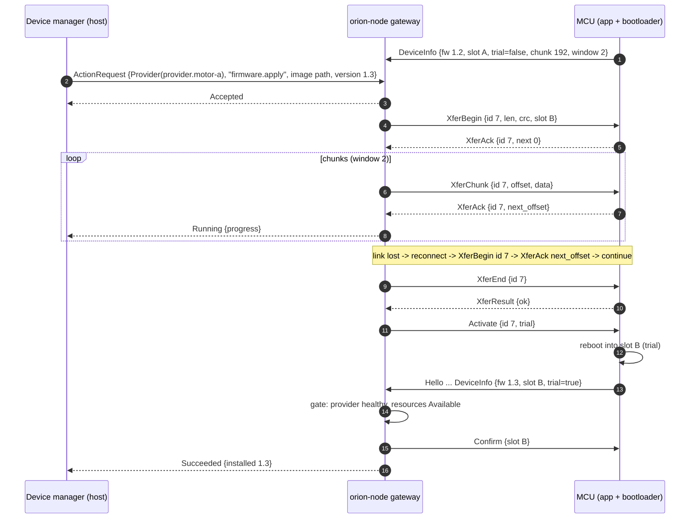
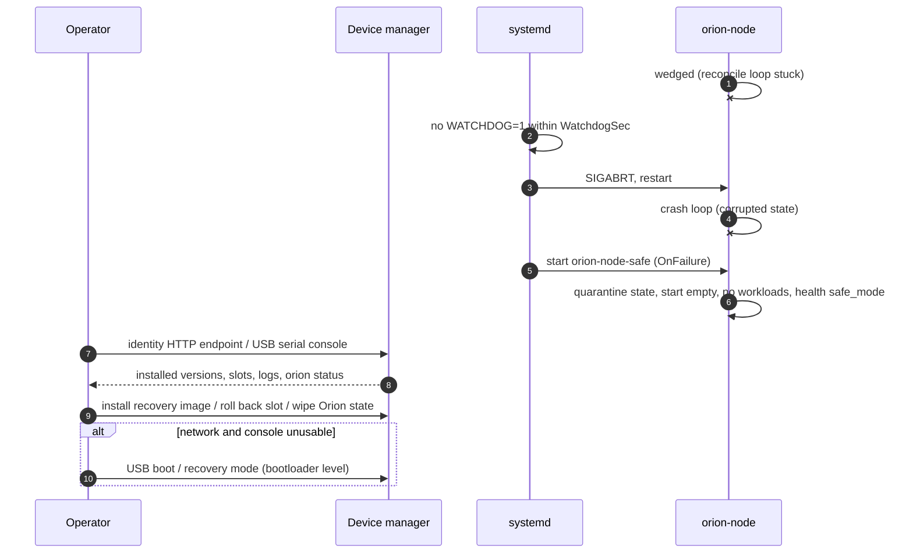

# Software Update and Recovery

Status: **design only**. Nothing in this document is implemented yet. It describes how device
software updates and recovery flow through Orion, which pieces Orion owns, which pieces it
deliberately does not own, and the order in which to build them. Open items are tracked in
[TODO.md](../TODO.md) under "Update / recovery".

What works today, without the records below, is the action-only path (option B): a device agent
claims the node action `update`, reports "staged and apply issued", and republishes `update.*`
status keys after every boot. Its contract, and how U3 builds on it, is in
[device-agent.md](device-agent.md).

Orion stays generic. It does not know what an OS image, a partition, a bootloader or a firmware
blob is. Component names, version strings and handler arguments are opaque strings to it, the same
way labels and resource types are (see [placement.md](placement.md)).

## Principles

1. **Orion carries intents and progress, not bytes on disk.** Orion records *what version a node
   should run* (an intent), delivers that intent to whoever installs it, and reports *how far the
   install got* (progress and outcome). The writer that downloads, verifies, writes an A/B slot,
   switches the bootloader and commits or rolls back belongs to an external **device-management
   package** (the "device manager" below). It talks to Orion as an ordinary local provider or
   executor, or through the generic action mechanism.
2. **Orion is never the only way in.** The device manager keeps independent recovery paths that do
   not touch Orion: its own identity HTTP endpoint, a USB serial console, and USB boot / recovery
   mode. A crashed, wedged, misconfigured or corrupted Orion must never block an update, a
   rollback or a recovery.
3. **The writer is the security boundary for artifacts.** Orion authenticates and authorizes who
   may *request* an update. The writer verifies artifact signatures and enforces anti-rollback with
   its own keys. A compromised Orion can at most ask for a correctly signed version.
4. **Everything is resumable.** Every step is driven by comparing desired intent with observed
   facts, so a reboot, a crash or a lost message in the middle of an update is repaired by the
   next reconcile, never by replaying a log.

## Building blocks this design relies on

| Building block | Status | Use here |
| --- | --- | --- |
| HLC last-writer-wins desired state ([peer-sync.md](peer-sync.md)) | implemented | Replicated, durable update intents. |
| Per-origin observed slices ([peer-sync.md](peer-sync.md#observed-state)) | implemented | Durable per-node update outcome, visible to peers. |
| Volatile status lane ([observability.md](observability.md#volatile-status-lane)) | implemented (local only) | Fine-grained progress telemetry (percent, bytes, stage). |
| Maintenance modes (`Cordoned`, `Draining`, `Maintenance`) and `schedulable` ([placement.md](placement.md)) | implemented | Drain a node before it reboots into a new image. |
| Node labels and selectors ([placement.md](placement.md)) | implemented | Choose rollout targets and waves. |
| Generic action mechanism: `ActionRequest` / `ActionResult` on the control plane; targets `Node`, `Provider`, `Resource`, `Executor`; free-form `name` + `args`; states `Accepted`, `Running { progress }`, `Succeeded`, `Failed`, `Rejected`, `TimedOut` | implemented, control protocol v4 ([actions.md](actions.md); node actions such as `update` can be claimed by an out-of-process device manager with `ClaimNodeActions`) | Delivering an intent to the device manager and imperative operations (abort, reboot, release a link). |
| Host facts on the observed `NodeRecord`, including OS / image version | implemented, control protocol v4 ([host-facts.md](host-facts.md): `os_version`, `image_name`, `image_version`, `boot_id`) | The observed "what is installed" fact that intents are compared against. |
| Audit log ([audit-logging.md](audit-logging.md)) | implemented (trust events) | Who requested which update. |
| MCU link protocol ([link-protocol.md](link-protocol.md)) | implemented (provider role, status) | Future in-band MCU firmware transfer. |

## Layering

```text
 operator / fleet tool / rollout controller
        |  orionctl apply, actions            (independent, always available)
        v                                     +------------------------------------+
 +--------------------------------------+     | device manager out-of-band paths   |
 | Orion (orion-node on every Linux     |     |  - identity HTTP endpoint           |
 | node)                                |     |  - USB serial console               |
 |  desired: UpdateIntent / Rollout     |     |  - USB boot / recovery mode        |
 |  observed: UpdateStatus, host facts  |     +------------------------------------+
 |  status lane: progress               |                    |
 |  actions: deliver / abort / reboot   |                    |
 +------------------+-------------------+                    |
                    | local IPC (provider / executor / action handler)
                    v                                        v
 +---------------------------------------------------------------------+
 | device manager (external package, one per Linux node)               |
 |  fetch, signature + digest verification, anti-rollback,             |
 |  A/B slot write, bootloader switch, boot counting, mark-good,       |
 |  local health checks, MCU flashing (own tools or via Orion link)    |
 +---------------------------------------------------------------------+
                    |
                    v
   bootloader (A/B slots, boot counter, automatic fallback) / MCU bootloaders
```

Dependencies only point downwards. The device manager can do everything without Orion (it is just
not told *what* to install unless someone uses its own endpoint). Orion can do nothing to disk
without the device manager. The bootloader can roll back without either of them.

## Data model

### Options considered

**A. Desired-state intent record.** A new HLC-merged desired-state section holds update intents
("node X, component C should be at version V, from artifact A"). Every node holds a full copy;
the target node's reconciler sees the difference between the intent and its observed version and
hands the work to the device manager.

- Durable and replicated: the requester can disconnect, the target can be partitioned or rebooting,
  and the intent still arrives when it syncs (same property as workload assignments).
- Naturally idempotent and resumable: the target compares "wanted" with "have" after every
  restart; there is nothing to replay.
- Fits the merge model: one writer (the requester) per intent object, last writer wins, deletes
  are tombstones.
- Costs a protocol bump for the new section and record types, and an intent is whole-object
  (LWW), so two people editing one intent concurrently lose one edit.

**B. Action only.** The requester sends an `ActionRequest { target: Executor("device-manager"),
name: "update.apply", args }` to the target node and follows its `ActionResult`.

- No new desired-state types; uses the mechanism that is being built anyway.
- Not durable: if the requester, the target node or the path between them goes away, the request
  and its result are gone. After the target reboots into the new image nothing remembers that the
  update was supposed to be committed or rolled back, and nothing knows what to retry.
- A staged rollout would need an always-on coordinator holding all state, which contradicts the
  leaderless model.

**C. Update as a workload.** Model an update as a `WorkloadRecord` with a dedicated runtime type,
assigned to the target node and executed by the device manager registered as an executor. This
works today without new types and is useful for prototyping, but workload phases
(`Running`/`Stopped`) describe long-running processes, not one-shot transitions with reboots in the
middle, and placement would try to move it on failover. Not recommended beyond a prototype.

### Recommendation: intent in desired state, actions as the delivery edge

Use **A for the source of truth and B for delivery and imperative operations**:

- `UpdateIntentRecord` (desired state) says what should be installed. It survives everything.
- The target node delivers the intent to the device manager as an `ActionRequest` (or the device
  manager watches intents directly, like `watch_assigned_workloads`). If the action is lost, the
  node re-delivers it on the next reconcile because desired and observed still differ.
- The device manager's `ActionResult` and status-lane entries are folded into the node's durable
  observed `UpdateStatusRecord`, which travels to peers in the observed slice.
- Purely imperative, non-convergent operations (abort the current download, reboot now, release a
  link port, collect logs) stay plain actions with no desired-state footprint.

This keeps the property that makes the rest of Orion robust: *desired versus observed*, compared
locally and repeatedly, with no coordinator.

### Records (sketch)

All fields are generic. Orion only compares version strings for **equality**; it never orders
them. Ordering, downgrade protection and compatibility belong to the writer.

```rust
/// Desired state, new section `update_intents`. Key: `UpdateIntentId`, conventionally
/// "<node_id>/<component>". One writer: whoever requests the update (operator, fleet tool,
/// rollout controller).
pub struct UpdateIntentRecord {
    pub intent_id: UpdateIntentId,
    pub node_id: NodeId,                 // target node
    pub component: String,               // opaque, e.g. "os", "mcu/motor-a"
    pub target_version: String,          // opaque; compared for equality only
    pub artifact: Option<ArtifactId>,    // or an opaque locator in `args`
    pub expected_digest: Option<String>, // optional hint; the writer verifies its own way
    pub handler: UpdateHandler,          // who performs it (see below)
    pub args: Vec<(String, TypedConfigValue)>, // free-form, passed through unchanged
    pub generation: u64,                 // bump to force a retry of the same version
    pub drain: DrainPolicy,              // None | Cordon | Drain { timeout_ms }
    pub rollout_id: Option<RolloutId>,   // set when created by a rollout
    pub paused: bool,
}

pub enum UpdateHandler {
    /// Deliver as an action to a registered executor or provider on the target node.
    Action { target: ActionTarget, name: String },
}

/// Observed state, in the target node's own observed slice (single writer: the target).
pub struct UpdateStatusRecord {
    pub intent_id: UpdateIntentId,
    pub node_id: NodeId,
    pub component: String,
    pub acting_on: Option<(String /*target_version*/, u64 /*generation*/)>,
    pub phase: UpdatePhase,
    pub installed_version: Option<String>,   // what is running now
    pub previous_version: Option<String>,    // what a rollback would return to
    pub last_error: Option<String>,
    pub updated_at_ms: u64,
}

pub enum UpdatePhase {
    Idle,            // installed == target, nothing to do
    Pending,         // intent seen, not delivered yet (paused, gated, draining)
    Delivered,       // action Accepted by the handler
    Applying,        // Running { progress }: download, verify, write
    AwaitingReboot,  // written to the inactive slot, waiting for the switch
    Verifying,       // booted the new slot in trial mode, health checks running
    Committed,       // marked good; installed == target
    Failed,          // the handler gave up; nothing changed on disk or it was undone
    RolledBack,      // the new version booted (or not) and the old one is active again
}
```

Host facts on the observed `NodeRecord` (parallel work) report the installed OS / image version
independently of any intent. `UpdateStatusRecord::installed_version` for component `os` should
come from the same source, so `orionctl get nodes` and `orionctl get updates` cannot disagree.

### How this interacts with HLC last-writer-wins

- **One writer per intent.** Intents are keyed per `(node, component)` and written by the
  requester only. The target never writes the intent; it reports progress in its own observed slice.
  This avoids the whole-object LWW problem of two parties editing one record.
- **Concurrent requesters** (two operators, or an operator and a rollout controller) resolve by
  HLC: the later write wins everywhere. `DesiredClusterState::version_of` exposes the winning
  writer's node tag, and the audit log records both requests.
- **Retry without a version change** uses `generation`: the target acts on
  `(target_version, generation)`, so rewriting an identical intent (new HLC stamp, same content)
  does not restart an update, but bumping `generation` does.
- **Deleting an intent means "no opinion"**, not "roll back". The target stops pursuing it and
  keeps whatever is installed. A rollback is an explicit intent for the previous version.
- **Clock skew**: an intent from a requester whose clock is more than
  `ORION_NODE_HLC_MAX_DRIFT_MS` ahead is rejected by peers like any other write. Rollout tooling
  must surface `clock_skew_rejections` rather than retry blindly.
- **Tombstone retention**: a node offline longer than `ORION_NODE_TOMBSTONE_RETENTION_MS` can
  resurrect a deleted intent. Because intents are equality-based and the writer enforces
  anti-rollback, the worst case is a stale "install V" that the writer refuses or that is already
  satisfied. Resetting a long-offline node (see safe mode) avoids it entirely.

### How this interacts with placement

- With `drain: Drain`, the target node switches itself to `Draining` before it reboots, so its
  observed record reports `schedulable = false` and placement moves placement-managed workloads
  away after `ORION_NODE_PLACEMENT_GRACE_MS`. Explicitly assigned workloads are not moved (as
  today); they stop with the reboot. The node returns to `Normal` once the update is committed or
  rolled back.
- Cross-node bindings to resources of the rebooting node become unavailable and are re-resolved
  after the grace period, exactly as for any owner loss.
- Rollouts should not take down every node that hosts a given resource type at once; rollout
  waves take a `max_unavailable` per selector group (below).

## Staged rollouts across nodes

A robot has many Linux coprocessors and MCUs. Updating them all at once risks bricking the robot,
so rollouts proceed in waves with health gates.

### Rollout record

```rust
/// Desired state, new section `rollouts`. Written by the operator or fleet tool.
pub struct RolloutRecord {
    pub rollout_id: RolloutId,
    pub component: String,
    pub target_version: String,
    pub artifact: Option<ArtifactId>,
    pub handler: UpdateHandler,
    pub args: Vec<(String, TypedConfigValue)>,
    pub selector: Vec<LabelRequirement>,   // which nodes take part
    pub waves: Vec<WaveSpec>,              // e.g. [canary 1 node, 25 %, rest]
    pub max_unavailable: u32,              // per wave, optionally per label group
    pub gate: HealthGate,
    pub state: RolloutState,               // Active | Paused | Halted { reason, by } | Done
}

pub struct HealthGate {
    pub soak_ms: u64,                 // how long a wave must stay healthy after commit
    pub require_ready: bool,          // node readiness true
    pub require_health: bool,         // node health not degraded
    pub require_resources: Vec<LabelRequirement>, // resources of the node that must be Available
    pub max_failures: u32,            // failed or rolled-back nodes tolerated before halting
}
```

### Who advances waves

Two models, built in order:

1. **External controller (first).** A rollout controller (an `orionctl rollout` command, the fleet
   tool or the device manager on a designated node) reads observed `UpdateStatusRecord`s and node
   health, and writes per-node `UpdateIntentRecord`s wave by wave. Orion only stores and replicates.
   Simple, easy to reason about, but the controller must be running for a rollout to advance (not
   for it to be safe: stopping the controller just stops the rollout).
2. **Leaderless (later), in `orion-cluster`.** Every node evaluates the `RolloutRecord` with the
   same deterministic function, like placement: nodes matching the selector are ordered by
   `rendezvous_score(rollout_id, node_id)` and cut into waves. A node starts its own update only
   when every node of the earlier waves reports `Committed` and has passed the gate for `soak_ms`,
   judged from the observed slices it received. It writes only its *own* intent (mirroring "the
   chosen node writes only its own assignment"). **Halting is monotonic**: any node that sees the
   failure budget exceeded writes `state = Halted { reason, by }`; every node that sees the same
   facts writes the same halt, so the writes converge. Only an operator clears a halt. This has the
   same limit as placement: nodes must be peered directly with the nodes whose progress gates them.

### Health gates

The gate is evaluated in two places with different jobs:

- **Local commit gate (device manager, not Orion).** After booting the new slot in trial mode the
  device manager runs its own checks and marks the slot good, or lets the bootloader's boot
  counter roll it back. Orion readiness can be *one input* to this gate (the new image's Orion
  should come up), but the commit decision and the fallback never require Orion to be working:
  if the device manager cannot reach Orion within its timeout, that counts as a failed check, and
  the bootloader falls back on its own.
- **Fleet gate (Orion / controller).** Decides whether the next wave may start: committed, ready,
  healthy, required resources `Available`, for `soak_ms`. Failures and rollbacks count against
  `max_failures`.

## Version compatibility during rolling updates

Today the control protocol requires **identical** `CONTROL_PROTOCOL_VERSION` on both ends
([protocol-compatibility.md](protocol-compatibility.md)): rkyv archives are layout-exact, and a
skew is refused with `ProtocolMismatch`. `orion-node` ships inside the OS image, so a rolling OS
update is also a rolling Orion update. Two cases:

1. **Same protocol version across the old and new release.** Mixed nodes sync normally. This is
   the common case and needs nothing new.
2. **The new release bumps the protocol version.** Updated and not-yet-updated nodes cannot sync
   with each other. The cluster temporarily splits into two sync islands.

### Recommended policy

- **Keep rollouts working across one protocol bump (N / N-1) on a narrow, frozen surface only.**
  Full desired-state sync stays same-version-only; making every archived type dual-version is not
  worth its cost. Instead add a small, **frozen-layout rollout beacon** (like the link protocol's
  frozen `Hello` / `Reject`): node id, component versions, `UpdatePhase` per component, health,
  readiness, and the highest protocol version spoken. It is signed with the node key and is
  accepted by any version that knows the beacon, so the fleet gate and `orionctl` can follow a
  rollout across the island boundary. Its layout never changes; extensions go in a new beacon kind.
- **Order updates so nothing depends on cross-version sync.** All intents for a rollout are
  written *before* the first node updates (each node has the full desired state locally, and state
  migration carries the intents forward), so a node in the new island still knows its own intent
  and can commit or roll back without talking to the old island.
- **Update order inside a robot**:
  1. canary Linux node (non-critical, ideally one that hosts redundant resources);
  2. remaining Linux nodes in waves, respecting `max_unavailable` per resource group;
  3. MCUs last, per gateway node, after their gateway node is committed. The link protocol is
     versioned independently and grows additively, so a new gateway must keep serving
     `LINK_PROTOCOL_VERSION` N-1 devices; an MCU is never required to update in lockstep with its
     gateway.
  Tooling (`orionctl`) of release N+1 must be able to read the beacon of release N nodes; the
  device manager's identity endpoint is the fallback view.
- **Make bumps rare.** Batch layout changes into one bump per release, prefer additive messages,
  and record in the release notes whether a release is "sync-compatible" with the previous one.
- **State directory downgrade.** A state directory written by a newer `orion-node` cannot be read
  by an older one ([peer-sync.md](peer-sync.md#upgrading-from-protocol-v2)). A rollback to the old
  slot therefore needs a readable state directory. Rule: a format migration keeps the old files
  (as `legacy-format-N/` already does) **until the update is committed**; on start, an older
  binary that finds a newer manifest falls back to the legacy copy if it exists, otherwise starts
  in safe mode with an empty desired state and pulls from peers of its own version. The device
  manager can also snapshot the state directory before switching slots, since it controls the
  partition layout.

## Delivery and progress

### Single-node update

```mermaid
sequenceDiagram
    autonumber
    participant Op as Operator / controller
    participant N as orion-node (target)
    participant DM as Device manager
    participant BL as Bootloader

    Op->>N: apply UpdateIntent {node, os, v2, artifact, gen 1}
    Note over N: HLC-stamped desired write, replicated to peers
    N->>N: reconcile: installed v1 != v2, phase Pending
    N->>N: drain (if requested): mode Draining, schedulable=false
    N->>DM: ActionRequest {Executor(device-manager), "update.apply", args, intent id, gen}
    DM-->>N: ActionResult Accepted
    N->>N: observed phase Delivered
    DM->>DM: fetch, verify signature + digest, anti-rollback check
    loop while writing slot B
        DM-->>N: Running {progress} / status lane update/os/progress_pct
    end
    DM-->>N: Running {stage: awaiting_reboot}
    N->>N: observed phase AwaitingReboot (persisted)
    DM->>BL: set next boot = B (trial, boot counter = 3)
    DM->>DM: reboot
    BL->>BL: boot slot B
    Note over N,DM: new orion-node starts, replays state, still sees intent v2 gen 1
    DM->>DM: local health checks (incl. Orion readiness, with timeout)
    DM->>BL: mark B good
    DM-->>N: report installed v2, Succeeded for (v2, gen 1)
    N->>N: observed phase Committed, installed v2, previous v1; mode Normal
    N-->>Op: observed slice to peers; rollout gate sees Committed
```

### Progress reporting

Three channels, each used for what it is good at:

| Channel | Content | Durability | Reaches peers |
| --- | --- | --- | --- |
| `ActionResult::Running { progress }` | per-request progress for the requester | per request | via the action path |
| Status lane, subject `executor/<device manager>` or `provider/<device manager>` (existing subjects; a link device's transfer under its own provider subject), keys such as `update/<component>/stage`, `update/<component>/progress_pct`, `update/<component>/bytes_done`, `update/<component>/eta_s` | fast-moving telemetry, TTL a few seconds above the publish interval | memory only | no (local; replication would follow the per-origin pattern) |
| `UpdateStatusRecord.phase` in the observed slice | coarse phase, versions, last error | persisted (coalesced) | yes |

Phase transitions are persisted immediately (bypassing observed-write coalescing) because they
are rare and are exactly what must survive a power cut. Progress percentages are never persisted.

### Idempotency and resume after reboot

The pair `(intent_id, target_version, generation)` is the idempotency key, carried in every
`ActionRequest`. Rules for the device manager (documented as the handler contract):

- A request whose key it has already completed returns `Succeeded` at once.
- A request whose key is in progress returns the current `Running { progress }`; it does not start
  a second write.
- A request for a new key while another is in progress either supersedes it (abort the old one,
  start the new one) or is `Rejected` with a reason; it must say which.
- It persists its own per-key state (slot written, trial boot pending, committed), because Orion's
  observed state is a report, not the writer's journal.

Rules for `orion-node` on every start and every reconcile:

- `installed == target`: phase `Committed` (or `Idle`); nothing to deliver.
- `installed != target`, not paused or gated: deliver (again). Re-delivery after a reboot, a crash
  or a lost `ActionResult` is safe by the contract above.
- No action handler registered yet (device manager not started): stay `Pending`, report it in
  health reasons after a timeout, and retry when the handler registers. Never fail the node.
- Action `TimedOut`: re-deliver with backoff; after a configurable number of attempts mark
  `Failed` with the last error. A new `generation` resets the count.

Power-cut matrix (the writer's journal plus the bootloader make each point safe; Orion only
re-delivers):

| Cut during | After power-on |
| --- | --- |
| download / verify | Old slot boots. Orion re-delivers; writer resumes or restarts the download. |
| slot write | Old slot boots; inactive slot is garbage. Writer rewrites. |
| bootloader switch | Bootloader uses the old or the new (trial) slot depending on atomicity of its env write; both are handled. |
| trial boot / health checks | Boot counter decrements; after N failures the bootloader boots the old slot. Writer reports `RolledBack`. |
| after mark-good | New slot is committed. Orion reports `Committed`. |

## Rollback and health gates

```mermaid
sequenceDiagram
    autonumber
    participant N as orion-node (new slot)
    participant DM as Device manager
    participant BL as Bootloader
    participant P as Peers / controller

    BL->>BL: boot slot B (trial, counter 3)
    alt Orion or system unhealthy in slot B
        DM->>DM: health checks fail or time out (Orion not reachable counts as failure)
        DM->>BL: do not mark good; reboot
        BL->>BL: counter exhausted -> boot slot A
    else kernel panic / hang before userspace
        BL->>BL: hardware watchdog reset, counter decrements, eventually slot A
    end
    Note over N,DM: old slot A runs; old orion-node, state dir via legacy copy if needed
    DM-->>N: Failed / RolledBack for (v2, gen 1), installed v1
    N->>N: observed phase RolledBack, last_error
    N-->>P: observed slice: RolledBack
    P->>P: failure budget exceeded -> Rollout Halted (monotonic)
```

- Automatic rollback is the bootloader's job and works with Orion completely absent.
- Orion never re-delivers an intent whose last outcome for the same `(version, generation)` was
  `RolledBack`; retrying needs a new `generation` (an explicit decision), so a bad image does not
  boot-loop the fleet.
- An operator-initiated rollback is an intent for `previous_version`; the writer may implement it
  as "switch back to the other slot" without a download.

## Security

- **Who may request.** Writing `update_intents` and `rollouts`, and sending update actions, needs
  an explicit permission, separate from ordinary desired-state writes: local IPC clients by role
  (`ControlPlane`) plus a UID allowlist (`SO_PEERCRED`), remote writes only from enrolled peers
  (ed25519, [peer-sync.md](peer-sync.md#threat-model-and-why-oriontcp-has-no-tls)). Proposed knob:
  `ORION_NODE_UPDATE_REQUESTERS` (UIDs and/or peer node ids), default local root only. Because
  desired state replicates, every node checks the writer of an intent it is about to *act on*
  (the stamp's node tag maps to an enrolled peer that is allowed to request updates), not only the
  node that accepted the write.
- **Artifact authenticity is not Orion's job.** The writer verifies signatures and digests against
  keys in the image (or a TPM / secure element), and enforces anti-rollback (monotonic security
  version). `expected_digest` in an intent is a hint for early failure, never a trust anchor.
- **Confidentiality**: intents travel like all desired state (signed; encrypted only over
  `https://` peers). Do not put secrets in `args`; artifact URLs that need credentials are resolved
  by the device manager from its own configuration.
- **Blast radius of a compromised Orion**: it can request installation of any correctly signed,
  non-rolled-back version, pause or halt rollouts, and lie about progress. It cannot install
  unsigned code or prevent out-of-band recovery.
- **Audit**: every accepted intent and rollout write, every update action and every outcome is an
  audit record (requester identity, node, component, versions, generation).

## Failure modes and recovery

Orion's failure must not block recovery. Each failure has a path that does not need Orion.

| Failure | Detection | Automatic response | Out-of-band path |
| --- | --- | --- | --- |
| `orion-node` crashed | systemd sees exit | `Restart=on-failure` with backoff | device manager endpoint, serial console |
| `orion-node` wedged (deadlock, stuck loop) | systemd watchdog: no `WATCHDOG=1` within `WatchdogSec` | systemd kills and restarts it | same |
| crash loop | systemd `StartLimitBurst` exceeded | `OnFailure=` starts `orion-node` in **safe mode** | same |
| persistent state corrupted or from a newer format | startup decode failure | safe mode (see below), instead of failing startup | device manager can wipe the state dir |
| node identity key unreadable | startup | safe mode without peer sync; health says why | re-enroll via serial console or device manager |
| node unreachable over the network | peers: liveness timeout; placement fails over | none needed for recovery | identity HTTP endpoint, USB serial console, USB boot / recovery |
| new image does not boot | bootloader boot counter, hardware watchdog | automatic fallback to old slot | USB boot / recovery |
| device manager down | Orion: no action handler / actions time out | intents stay `Pending`, health reason | serial console; systemd restarts it |
| MCU firmware bad | device does not confirm the trial slot | MCU bootloader reverts | MCU bootloader mode, SWD / USB DFU via device manager |

### Supervision (systemd watchdog)

`orion-node` does not integrate with systemd today. Proposed (feature `systemd`, no libsystemd
dependency: a datagram to `$NOTIFY_SOCKET`):

- `READY=1` once replay completed and the control sockets are bound.
- `WATCHDOG=1` from the reconcile loop itself (not from a separate timer task), only while the loop
  completes passes, so a wedged loop or a deadlocked state lock stops the heartbeat.
- `STATUS=` with a one-line health summary.

Example unit fragment (shipped as an example, not imposed):

```ini
[Service]
Type=notify
WatchdogSec=30s
Restart=on-failure
RestartSec=2s
StartLimitIntervalSec=300
StartLimitBurst=5
OnFailure=orion-node-safe.service
```

### Safe mode

`ORION_NODE_SAFE_MODE=1` (or the safe-mode unit, or automatically when persisted state cannot be
decoded) starts the node so that it can be inspected and repaired, never so that it does harm:

- Moves the state directory's desired, observed and history files aside to
  `<state dir>/quarantine-<unix ms>/` (never deletes them) and starts with an empty desired state.
  Keeps the node identity and trust store if they decode.
- Starts no workloads and makes no placement or lease writes; reports `schedulable = false`,
  maintenance mode `Maintenance`, and a health reason `safe_mode: <cause>`.
- Serves local IPC, health, readiness and observability, and accepts actions, so the device
  manager and `orionctl` can still talk to it.
- Peer sync is receive-only until the operator leaves safe mode (`orionctl maintenance` back to
  normal plus a restart), which avoids resurrecting deleted objects from a stale copy.

## Observability

- `orionctl get updates` (per node and component: phase, installed, target, generation, last
  error, age) and `orionctl rollout status <id>` (waves, gate state, failures, halt reason).
- Metrics: `orion_update_intents{phase}`, `orion_update_phase_transitions_total{component,to}`,
  `orion_update_redeliveries_total`, `orion_update_action_timeouts_total`,
  `orion_rollout_nodes{rollout,state}`, `orion_safe_mode` (0/1), `orion_watchdog_last_ping_ms`.
- Events in the observability snapshot for phase transitions, halts, safe-mode entry and
  watchdog-related restarts (restart count from the previous run's persisted boot marker).
- Health reasons: `update_handler_missing`, `update_failed:<component>`, `safe_mode:<cause>`.
- The rollout beacon is the cross-version observability surface during a protocol bump.
- The device manager's own endpoint mirrors the essentials (installed version, slots, last
  outcome) so an operator can see them with Orion down.

## MCU firmware over the link protocol (future work, sketch)

MCUs behind a link gateway are updated today only out of band (vendor bootloader, SWD, USB DFU,
driven by the device manager). The link session is owned by `orion-node`'s gateway, so an in-band
path needs Orion to **tunnel** bytes. Orion still is not the writer: the host-side device manager
chooses and verifies the image, and the MCU's bootloader verifies it again and owns the slot
switch.

### Reserved kinds

Reserve `0x20`–`0x2F` for device information and chunked transfer. Unknown kinds are ignored by
existing sessions, so this is additive (no `LINK_PROTOCOL_VERSION` bump), and devices that do not
implement it never see it unless the host knows they advertised support.

| Kind | Name | Direction | Body (postcard) |
| --- | --- | --- | --- |
| `0x20` | `DeviceInfo` | device → host | `fw_version: String`, `active_slot: u8`, `slots: u8`, `trial: bool`, `xfer_max_chunk: u16`, `xfer_window: u8`, `bootloader: String` (sent after `Welcome`, retransmitted until acked like `ProviderState`) |
| `0x21` | `XferBegin` | host → device | `xfer_id: u32`, `component: String`, `version: String`, `total_len: u32`, `chunk_len: u16`, `image_crc32c: u32`, `target_slot: u8` |
| `0x22` | `XferChunk` | host → device | `xfer_id: u32`, `offset: u32`, `data: [u8]` |
| `0x23` | `XferAck` | device → host | `xfer_id: u32`, `next_offset: u32` (cumulative), `status: u8` |
| `0x24` | `XferEnd` | host → device | `xfer_id: u32` (device verifies whole-image CRC and its signature) |
| `0x25` | `XferResult` | device → host | `xfer_id: u32`, `status: u8` (ok, crc, signature, flash, no_space, busy, unsupported) |
| `0x26` | `XferAbort` | either | `xfer_id: u32`, `reason: u8` |
| `0x27` | `Activate` | host → device | `xfer_id: u32`, `mode: u8` (trial-boot slot, or bootloader handoff) |
| `0x28` | `Confirm` | host → device | `slot: u8` (mark good after the host-side health gate; devices may self-confirm) |
| `0x29`–`0x2F` | reserved | | |

`Hello` is frozen, so support is advertised by sending `DeviceInfo`, never by a `Hello` field.

### Transfer rules

- Every frame is already CRC-32C checked; the whole image additionally carries `image_crc32c` and
  the device bootloader checks the image signature. Chunks are **offset-addressed**, so duplicates
  and retransmissions are idempotent.
- Flow control is a cumulative ack with a small window (`xfer_window`, 1 for the smallest devices:
  stop-and-wait). Chunk size is at most the negotiated `max_frame` minus headers, so the device can
  write each chunk straight to flash through a page buffer it already has; no full-image RAM
  buffer.
- **Resume**: after a link loss or host restart the host sends `XferBegin` with the same `xfer_id`;
  the device answers `XferAck { next_offset }` from its own persisted progress (or 0) and the host
  continues from there.
- Normal session traffic (heartbeats, provider state, leases) continues during a transfer and has
  priority; transfer frames fill the remaining link budget so the device does not appear lost.
- The transfer code is a separate `orion-link` feature (`xfer`) so devices that never update
  in band pay nothing.

### Activation

- **A/B devices** (two slots, e.g. an MCUboot-style swap/test mode): `Activate { trial }` reboots
  into the new slot; the device reconnects, sends `DeviceInfo { trial: true }`; after the
  host-side gate (provider state healthy, resources `Available`, status keys sane, within a
  timeout) the host sends `Confirm`. No confirm before the device's own timeout means the device
  bootloader reverts.
- **Single-slot devices**: `Activate { bootloader_handoff }` makes the app jump to its resident
  bootloader. The link session ends; the device manager takes over the port with its own flashing
  protocol (an action `link.release { link, device }` asks the gateway to stop serving the port
  and `link.attach` gives it back). Orion is out of the loop for the actual write.



## Recovery when Orion is unavailable



## Implementation plan

Recovery comes before update features: the first milestones make Orion safe to have on the
critical path at all. Each milestone is independently useful and testable.

| # | Milestone | Content | Depends on |
| --- | --- | --- | --- |
| U0 | Prerequisites (parallel work) | Generic action mechanism; host facts with OS / image version on the observed `NodeRecord`. | — |
| U1 | Supervision | Feature `systemd`: `READY=1`, `WATCHDOG=1` from the reconcile loop, `STATUS=`; example unit with watchdog, restart limits and `OnFailure`; test that a wedged loop stops the heartbeat. | — |
| U2 | Safe mode | `ORION_NODE_SAFE_MODE`; quarantine instead of failing on undecodable state; no workloads, receive-only sync, health reason; `orion_safe_mode` metric; tests for corrupted and newer-format state dirs. | — |
| U3 | Data model | `UpdateIntentRecord` desired section, `UpdateStatusRecord` in the observed slice, protocol bump, layout fingerprint, `orionctl apply` / `get updates`, requester authorization (`ORION_NODE_UPDATE_REQUESTERS`), audit records. | U0 |
| U4 | Delivery and resume | Reconciler that delivers intents as actions with the idempotency key, re-delivery and backoff, phase persistence, status-lane progress keys, drain integration; a fake device manager in `examples/` and tests that kill the node or the handler at every phase. | U3 |
| U5 | External rollout controller | `RolloutRecord`, waves, `max_unavailable`, health gate, monotonic halt; `orionctl rollout` as the first controller. | U4 |
| U6 | Cross-version rollouts | Frozen rollout beacon; legacy state-dir copy kept until commit and used on downgrade; documented "sync-compatible" flag per release; a test that runs N and N+1 nodes through a rollout. | U5 |
| U7 | Leaderless rollouts | Wave assignment and gate evaluation in `orion-cluster` (rendezvous order, own-intent writes, convergent halt); property tests like placement's. | U5 |
| U8 | MCU firmware over the link | Reserve kinds `0x20`–`0x2F` now (doc + constants); later `DeviceInfo`, `xfer` feature in device and host sessions, gateway tunnelling and `link.release` / `link.attach` actions, simulator test with link loss and resume, size budget for the `xfer` feature. | U4 |
| U9 | Hardware validation | Real A/B writer on a Linux board, power-cut and watchdog fault injection at every phase, an MCU with an A/B bootloader over UART and CAN. | U4, U8 |

U1 and U2 have no dependencies and can start immediately. U3 should be batched with other
pending layout changes into one `CONTROL_PROTOCOL_VERSION` bump.

## Non-goals

- Orion does not download, verify, write or boot images, and does not ship a device manager.
- Orion does not order version strings or decide compatibility between versions of user software.
- Orion does not replace the bootloader's automatic fallback or the device manager's out-of-band
  paths, and none of them may depend on Orion.
- No delta or peer-to-peer artifact distribution in this design; artifacts are fetched by the
  writer (Orion's artifact store may be one source it uses, but nothing requires it).
